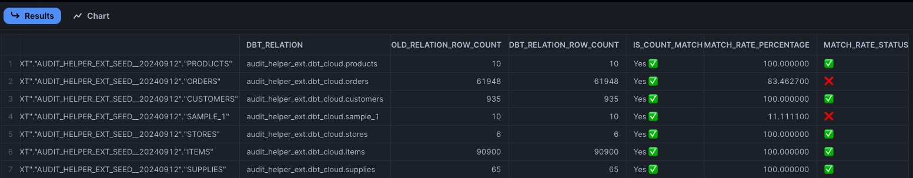
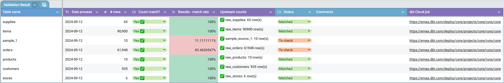

<!-- markdownlint-disable no-inline-html no-alt-text -->
# dbt-audit-helper-ext


Extended Audit Helper solution 💪

Supporting:

- Snowflake
- BigQuery

## Installation

- Copy this repo to your dbt project. We will treat it as the local package until it's published
- Add to `packages.yml` or `dependencies.yml` file:

```yml
packages:
  - local: dbt-audit-helper-ext
```

- Deploy the resources:

```bash
dbt deps
dbt run -s audit_helper_ext
# it will create log table and the summary view on top
```

## Validation Strategy

This repo contains the **useful macros** to support for saving the historical validation results into the DWH table ([`validation_log`](./models/validation_log.sql)), together with the latest summary table ([`validation_log_report`](./models/validation_log_report.sql)).

There are 3 main types of valition:

- Count (`count`, [source](./macros/validation/get_validation_count.sql))
- Column by Column (`all_col`, [source](./macros/validation/get_validation_all_col.sql))
- Row by Row (`full`, [source](./macros/validation/get_validation_full.sql))

Additionally, we have the 4th type - `upstream_row_count` ([source](./macros/validation/get_upstream_row_count.sql)) which will be very useful to understand better the validtion context, for example, _the result might be up to 100% matched rate but there is 0 updates in the upstream models, hence there no updates in the final table, that means we can't not say surely it was a perfect match_.

Depending on projects, it might be vary in the strategy of validation. Therefore, in this package, we're suggesting 1 approach that we've used successfully in the real-life migration project (Informatica to dbt).

**Context**: Our dbt project has 3 layers (staging, intermediate, and mart). Each mart model will have the independant set of upstream models, or it is the isolated pipeline for each mart model. We want to validate mart models only.

**Goal**: 100% matched rate ✅, >=99% is still good 🟡, and below 99% is unacceptable ❌

**Pre-requisites**: 2 consecutive snapshots (e.g. Day1, Day2) of both source data and mart tables

**Flow**:

- _Freeze the source data_, so we have `source__YYYYMMD1` and `source__YYYYMMD2`, `mart__YYYYMMD1` and `mart__YYYYMMD2`
- _Scenario 1: Validate the fresh run against D1_
  - Configure source yml to use `source__YYYYMMD1`
  - Run dbt to build mart tables, callled `mart_dbt`
  - Run validation macros to compare between `mart_dbt` vs `mart__YYYYMMD1` 👍
- _Scenario 2: Validate the incremental run against D2 based on D1_
  - Configure source yml to use `source__YYYYMMD2`
  - Clone `mart__YYYYMMD1` to `mart_dbt` to mimic that dbt should have the D1 data already (e.g. [clone_relation](./macros/dwh/clone_relation.sql))
  - Run incrementally dbt to build mart tables
  - Run validation macros to compare between `mart_dbt` vs `mart__YYYYMMD2` 👍👍

Finnally, check the validation log report, and decide what to do next steps:

🛩️ Sample report table on Snowflake:



💡 Optionally, let's build the Sheet to communicate the outcome with clent, here is the BigQuery+GGSheet sample:



## Demo

TODO

## How to Contribute

`dbt-audit-helper-ext` is an open-source dbt package. Whether you are a seasoned open-source contributor or a first-time committer, we welcome and encourage you to contribute code, documentation, ideas, or problem statements to this project.

👉 See [CONTRIBUTING guideline](./CONTRIBUTING.md)

<!-- 🌟 And then, kudos to **our beloved Contributors**:

<a href="https://github.com/infinitelambda/dbt-audit-helper-ext/graphs/contributors">
  
</a> -->

## About Infinite Lambda

Infinite Lambda is a cloud and data consultancy. We build strategies, help organizations implement them, and pass on the expertise to look after the infrastructure.

We are an Elite Snowflake Partner, a Platinum dbt Partner, and a two-time Fivetran Innovation Partner of the Year for EMEA.

Naturally, we love exploring innovative solutions and sharing knowledge, so go ahead and:

🔧 Take a look around our [Git](https://github.com/infinitelambda)

✏️ Browse our [tech blog](https://infinitelambda.com/category/tech-blog/)

We are also chatty, so:

👀 Follow us on [LinkedIn](https://www.linkedin.com/company/infinite-lambda/)

👋🏼 Or just [get in touch](https://infinitelambda.com/contacts/)

[](https://infinitelambda.com/)
